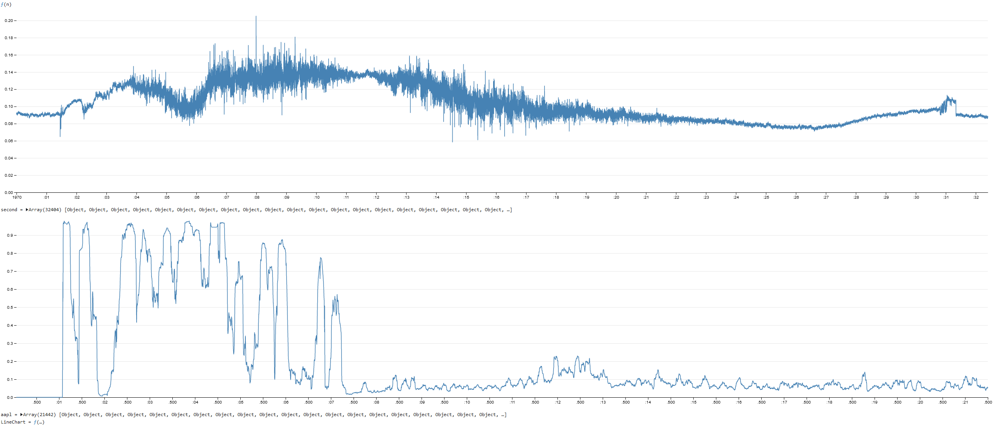

# **CS.067 ML Applied to Magnetic Flux Dataset README**
Machine learning applied to magnetic flux datasets (.tdms files) to detect anomalies within the data.

## **Machine Learning**

### **Packages**
- Python 3.9
    - Libraries
        - npTDMS: https://pypi.org/project/npTDMS/ 
        - NumPy: https://pypi.org/project/numpy/ 
        - Sklearn: https://pypi.org/project/scikit-learn/ 
        - Torch (pyTorch): https://pypi.org/project/pytorch/
        - Numba: https://pypi.org/project/numba/ 
        - Fastdtw: https://pypi.org/project/fastdtw/
        - dtaidistance: https://pypi.org/project/dtaidistance/
        - scipy: https://pypi.org/project/scipy/ 

> ### **Steps to run**
> 1. Install all libraries using pip install (according to the links above).
> 2. Run any of Zinn or Matt’s methods with `py [FILENAME].py`
>    - Expecting a file named melt.tdms

> 1. For pyTorch, follow the instructions on the pyTorch website. This is because your local machine’s compute platform may be different (i.e. CUDA vs. CPU).
> 2. For dynamic time warping or covariance detection, run the python file with `py [FILENAME].py [data1_path] [data2_path]`.

### **Machine Learning Github repository:**

https://github.com/justinflesch/magnetic-flux-anomaly-detection 

Note: More documentation is available in our repository under:
- Zinn Tests/Zinn_ML_Documentation.ipynb
- Dtw\basic_dtw.ipynb
- Covariance\Covariance_Detection.ipynb
- rulsif/RulsifNotes.pdf

### **Unrealized features:**
- The scope of this project changed drastically from the original scope of this project. Because of this, it’s hard to enumerate a list of unrealized features. However, this project could be improved upon in general with different algorithms and hyperparameter tuning.

## **Data Utilities**

Data utilities allow us to modify and access data. Specifically, we want to create methods to access important data pertaining to Ampere Scientific data.

### **Data Normalization**

Data normalization simply scales the data from the range [0,1] of the absolute value of the original data set. We simply find the absolute value and the quotient of max value of the data.

```py
def normalize(df):
    print("Beginning data normalization...")
    normalized_df = df.copy()
    for col in normalized_df.columns:
        normalized_df[col] = normalized_df[col] / normalized_df[col].abs().max()
    print("Data normalization completed.")
    return normalized_df
```

### **Data Virtualization**

Data virtualization allows us to virtualize the data into a proper dataframe for data analysis. We convert this into a  dataframe object using the file path.

```py
def virtualize(filepath):
    tdms_file = TdmsFile.read(filepath) 
    df = tdms_file.as_dataframe() 
    return df
```

### **Data Visualization**

Visualizing the data is necessary for obtaining a greater understanding of the data. We can plot the data using a simple matplotlib library to plot the data.

```py 
def visualize(df):
    print("Visualizing data...")
    for c in ['r', 't', 'z']:
        plt.figure() 
        for col in df:
            if str(col)[17] == "P" and str(col)[-2] == c: 
                plt.plot(df[col])
        xmin, xmax = plt.xlim()
        minute_labels = np.arange(0, xmax * (0.01/60), 1)
        x_values = np.arange(0, len(df[col]), (len(df[col]) / len(minute_labels)))
        plt.xticks(x_values, np.round_(minute_labels))
        plt.title(c)
        plt.xlabel("time (minutes)")
        plt.legend(loc='best')
    plt.show()
    print("Visualization completed.")
```

### **Data Conversion**

Converting the data files from tdms type to csv type may be necessary to properly access the data in a dataframe. We can first convert it to a proper data frame and append a “Time” label for the first column.

```py
def tdms_to_csv(filepath):
    tdms_file = TdmsFile.read(filepath)
    df = tdms_file.as_dataframe() 
    csv_filepath = filepath.rsplit(".", 1)[0] + ".csv"
    df.to_csv(csv_filepath)
    with open(csv_filepath, 'r') as original: data = original.read()
    with open(csv_filepath, 'w') as modified: modified.write("/\'Time\'" + data)
    return csv_filepath
```

We can easily convert a set of files using a directory path. This method allows us to both convert a directory of files or a single file, both with or without replacement (overwrite if it exists).

```py
def tdms_to_csv_dir(dir_path, replace=False):
    for subdir, dirs, files in os.walk(dir_path):
        print(subdir, dirs, files)
        for file in files:
            if (file.endswith('.tdms') and ((file.replace(".tdms", ".csv") \
            not in files) or replace == True)):
                tdms_to_csv(os.path.join(subdir, file))
```

### **Other tools**

We can apply simple debugging by applying a timer decorator.  A decorator is basically a way to modify a function by wrapping another function around it to extend the behavior of the wrapped function without modifying the original method.  A timer decorator is useful if we want to print out a function's run time. Potential applications would include if a function is running unusually long.

```py
def timer_decorator(func, time_filter=None):
    @functools.wraps(func)
    def wrapper(*args, **kwargs):
        t0 = time.time()
        results = func(*args, **kwargs)
        t1 = time.time()
        if (time_filter and (round((t1 -t0)*1000,1) > time_filter)) or time_filter == None:
            print('Function', func.__name__, 'time:', round((t1 -t0)*1000,1)/1000, 'seconds')
        return results
    return wrapper
```

We will have to load csv files to a numpy array for data processing. This is in the form of a numpy data frame. Note that this method is expensive and should only be used once for each file.

```py
def load_data_sensors(csv_path) -> np.ndarray:
    data = np.genfromtxt(csv_path, dtype=np.double, delimiter=',', names=True)
    rows = len(data)
    cols = len(data[0])
    print("Rows and columns of data:\nrows:", rows, "cols:", cols, '\n')
    return data
```

With this data, we want to format in a way to easily access specific data points. In the Ampere Scientific data, we have the general labels and the r, t, and z labels in the P rows and C columns.  We can obtain an array of column sensors, an array of row sensors, a list of the column sensors, and a list of row sensors.

```py
def PC_data(data, dim=((1,16),(1,16))) -> np.array:
    l1 = ['r', 't', 'z']
    sensors_row = np.array(["MeasurementsP" + f'{x:02d}' + "C" + f'{y:02d}' + z for x in range(dim[0][0], dim[0][1] + 1) for y in range(dim[1][0], dim[1][1] + 1) for z in l1])
    num_sensors = np.size(sensors_row)
    sensors_col = np.array(["MeasurementsP" + f'{x:02d}' + "C" + f'{y:02d}' + z for y in range(dim[1][0], dim[1][1] + 1) for x in range(dim[0][0], dim[0][1] + 1) for z in l1])
    print("The number of total possible PC sensors:\n", num_sensors)
    sensors_rtz = sensors_row.reshape(int(num_sensors/3), 3)
    sensors_rtz2 = sensors_col.reshape(int(num_sensors/3), 3)
    sensors_row_rtz = sensors_row.reshape(int(num_sensors/(3*16)), 16, 3)
    sensors_col_rtz = sensors_col.reshape(int(num_sensors/(3*16)), 16, 3)
    sensors_array = np.transpose(np.array([data[x] for x in sensors_row if x in data.dtype.fields]).astype(np.double))
    rows = np.size(sensors_array, axis=0)
    cols = np.size(sensors_array, axis=1)
    print("Rows and columns of PC sensors array:\nrows:", rows, "cols:", cols, '\n')
    sensors_rtz_array_row = np.transpose(np.array([np.linalg.norm([data[rtz[0]], data[rtz[1]], data[rtz[2]]], axis=0) for rtz in sensors_rtz \
    if rtz[0] in data.dtype.fields and rtz[1] in data.dtype.fields and rtz[2] in data.dtype.fields]).astype(np.double))
    sensors_rtz_array_col = np.transpose(np.array([np.linalg.norm([data[rtz[0]], data[rtz[1]], data[rtz[2]]], axis=0) for rtz in sensors_rtz2 \
    if rtz[0] in data.dtype.fields and rtz[1] in data.dtype.fields and rtz[2] in data.dtype.fields]).astype(np.double))
    row_rtz_list = [np.transpose([np.linalg.norm([data[rtz[0]], data[rtz[1]], data[rtz[2]]], axis=0) for rtz in P \
    if rtz[0] in data.dtype.fields and rtz[1] in data.dtype.fields and rtz[2] in data.dtype.fields]) for P in sensors_row_rtz]
    col_rtz_list = [np.transpose([np.linalg.norm([data[rtz[0]], data[rtz[1]], data[rtz[2]]], axis=0) for rtz in P \
    if rtz[0] in data.dtype.fields and rtz[1] in data.dtype.fields and rtz[2] in data.dtype.fields]) for P in sensors_col_rtz]
    rows_mag = np.size(sensors_rtz_array_row, axis=0)
    cols_mag = np.size(sensors_rtz_array_row, axis=1)
    print("Rows and columns of PC sensor rtz magnitude array:\nrows:", rows_mag, "cols_mag:", cols_mag, '\n')
    return sensors_array, sensors_rtz_array_row, sensors_rtz_array_col, row_rtz_list, col_rtz_list
```

## **Data Visualization**

Github repository containing code for our D3 Line-Chart editing: https://github.com/justinflesch/linechart-for-magnetic-flux

Packages:
- Node JS: 12.22.9
    - Libraries:
        - http-server
- Python: 3.9
    - Libraries:
        - pandas
        - nptdms
        - numpy

> Steps to run:
> First, the data files must be formatted properly.  To format the ML output, use the fix_ML_output.py file for creating a `_fixed.csv` file that will work with the webapp by running `py fix_ML_output.py <your file here>` and a `_fixed.csv` file will be saved to the same folder that the ML output csv is stored in, here’s an example command:

```console
flux$ python fix_ML_output.py /home/justin/Documents/OSU/capstone/linechart-for-magnetic-flux/anomalydetection.csv
```

The path to the fixed data would be:

```console
/home/justin/Documents/OSU/capstone/linechart-for-magnetic-flux/anomalydetection.csv
```

To format the sensor data, first note that **smaller data works best**.  To use any tdms data with this webapp, run it through the `viz-tdms-to-csv.py` file in the Line-Chart repo using `py viz-tdms-to-csv.py <your file here>`, this is a separate script from the `tdms-to-csv.py` file in the magnetic-flux-anomaly-detection repository, you can pass it a folder or a tdms file directly, here’s two examples of running it, firstly with the parent folder, then with a file:

```console
flux$ python tdms-to-csv.py ..
```

```console
flux$ python tdms-to-csv.py /home/justin/Documents/OSU/capstone/Combined---EQS-VAR3---09m-09d-20y_ls.tdms
```

To use webapp code, pull (or fork and pull, if changes are necessary) from this repository, then cd into the repository, to run the D3 webapp, run http-server in the main folder of the repository.  Here’s an overview of how the code can be edited to change what is displayed by the app:

```js
export default function define(runtime, observer) {
    console.log("Hello!");
    const main = runtime.module();
    const fileAttachments = new Map([["aapl.csv",new URL("./anomalydetection_fixed.csv",import.meta.url)]]);
    const fileAttachments2 = new Map([["second.csv",new URL("./Combined---EQ5-VAR3---09m-09d-20y_is.csv",import.metal.url)]])
}
```

In the file, `b197e99c9606ebd8@331.js`, lines 7 and 8 contain file paths to the data used for the graphs.  Line 7 is the file path used for the first graph, and line 8 is for the second graph.  These file paths are within the working directory of the rest of the main LineChart repo, you can change them to be absolute paths or move them into the directory of your LineChart.

```js
    main.variable(observer("chart2")).
        LineChart(second, {
            x: d => d.index,
            y: d => d.P01C03t,
            xLabel: "Time (ms)",
            width,
            height: 500,
            color: "steelblue"
        })
)});
```

The x and y calls of the respective main.variables are the columns that will be pulled from the CSV for a given graph.  The first main.variable is for the first graph, and the second is the second. 

Restart http-server when you’re done making changes.  Finally, when you search for `localhost:8080` on your browser, this is what you should get (or something similar depending on your sensor/measurement):



Unrealized features:
- User interact-ability
    - Zoom on data
    - Select sensor/ML data within D3 webapp
    - Mark data
